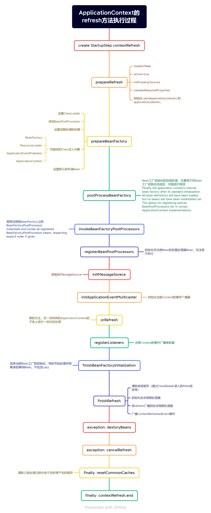

# 2022-05-07 ~ 2022-05-09

- 初始化项目，构建omega父工程及omega-core模块。

- 编写第一个注解@Component，此注解参照Spring的@Component注解，通过此注解告知omega容器该类为待托管的类

- 编写基于Java包路径的类扫描逻辑

  - 基于ClassLoader进行当前JVM上下文指定basePackage的URL扫描
  - 根据jar和file两种类型，遍历其包及子包路径下的Class文件
  - 载入Class文件
  - 过滤未使用@Component注解的Class

# 2022-05-09
借鉴Spring框架， 在原有Component注解的基础之上，扩展Service注解。
  
Spring在处理的时候，使用了注解的注解，即@Service注解使用了@Component注解，
同时在扫描的过程中，对注解的注解进行递归，进而判断该类是否需要由容器管理。

这种方式需要扩展扫描器的判断逻辑，同时需要注意一些问题
1. 需要过滤掉java包自身的几个注解，因为他们存在了相互使用或自身使用。直接递归会导致栈溢出问题，如@Documented代码
  ``` java
  @Documented
  @Retention(RetentionPolicy.RUNTIME)
  @Target(ElementType.ANNOTATION_TYPE)
  public @interface Documented {
  }
  ```
2. 仅过滤java包，仍然会存在潜在风险。
   因为我们的目标是像Spring框架一样，可以做为第三方工具框架被使用，
   所以如果最终用户编写了自定义注解，且这些注解间也存在了互相使用的问题，依然会导致栈溢出。
3. 但如果将注解的扫描范围限在```com.mostaron.core.annotation```，则会严重限制代码的可扩展性。
   且如果用户将自定义注解也写在这个包下同时互相使用，仍然会重复问题2的结果。
4. 基于这些原因，在进行递归的过程中，加入递归深度计数器，暂定递归深度为**5**，超过将不再继续递归，而是直接返回否。

## 残留问题
目前只判断了类是否被@Component注解及其子注解标记，
但使用@Component的子注解并未将其Meta信息传递或标记出来，
这将导致通过Component的子注解筛选出来的对象，无法找到对应的Component注解，并进行相关处理。

Spring使用的方法为建立了一整套的MergedAnnotation处理方案，将多个不同的注解进行了合并，
同时使用MetadataReader进行相关的属性读取处理。

因此需要对isComponent方法再次重构，在判断是否被Component的最终子注解标记的同时，还需要记录该注解，
这样在后续的缓存Bean构建时，才可以根据这些配置信息进行自定义的处理。

# 2022-05-11
鉴于之前的残留问题，参考BeanDefinition的实现，编写Bean的定义类，存储Metadata等相关信息。

在初期扫描的过程中，将除java包下的其它Annotation依次添加至一个对应的ArrayList，以备后续使用。
同时还需要考虑多级Annotation的属性合并操作。

编写BeanDefinition对象，保存被托管Class的定义，包含Class名称、Class对象、注解列表等信息。
在遍历判断某个类是否为被托管对象时，同时计算其注解列表并处理。

在计算注解列表时，会逐级获取注解中包含@ApplyTo的属性，并将这些属性写回父级注解中。

## 注解属性合并处理

在递归遍历注解列表时，会生成一个默认的属性池，属性池的数据结构如下：
``` java
 Map<Class<? extends Annotation>, Map<String, Object>> metadataBox
```
该常量池的Key为被```@ApplyTo```注解标过的父级注解，Value为子注解中配置的属性名及值的Map集合。
属性合并遵循以下操作逻辑
1. 判断属性池中是否存在当前注解的属性，若存在则覆盖之。
    ```
    由于在JVM中，注解会被处理为代理类，所以需要通过代理来获取JVM中注解对应的代理对象InvocationHandler，
    在InvocationHandler中，使用了Map对象memberValues保存了原注解类定义的属性及其值。
    所以属性的覆盖，本质上就是对该Map的覆盖。
   
    JVM中注解的代理InvocationHandler对象最终被sun.reflect.annotation.AnnotationInvocationHandler来实现。
    由于本项目开发时基于JDK17，而在当前版本中，由于模块化的问题，会导致系统没有权限反射至sun.reflect包中，所以需要在启动时添加如下JVM参数：
    --add-opens java.base/sun.reflect.annotation=ALL-UNNAMED
   
    对于这个问题，后期将考虑将本项目升级为支持模块化。
    ```
2. 遍历当前注解中是否存在使用了```@ApplyTo```注解的属性，若存在则将其合并至属性池。

    1. 遍历当前注解Class包含的Method
    2. 将Method对象包装为MergeInfo对象
    3. 过滤出未使用```@ApplyTo```注解的Method
    4. 判断属性池是是否已经包含```@ApplyTo```注解标识的父注解及其属性的键值对
    5. 在递归的过程中，是由子级逐渐向父级递归，若已存在属性配置，表示在上级时已经处理过，优先级要高于当前注解，故不再处理
    6. 若不存在，同将其合并至属性池

至此，BeanDefinition的初步创建已经完成。

下一步将处理Bean初始化的过程，在未实现AOP之前，将暂时使用二级代理的方式处理，以规避循环依赖的问题。

# 2022-05-12

## Spring的AbstractApplicationContext.refresh都做了什么

```java
public abstract class AbstractApplicationContext extends DefaultResourceLoader
        implements ConfigurableApplicationContext {
    
        
	@Override
	public void refresh() throws BeansException, IllegalStateException {
		synchronized (this.startupShutdownMonitor) {
			StartupStep contextRefresh = this.applicationStartup.start("spring.context.refresh");

			// Prepare this context for refreshing.
			prepareRefresh();

			// Tell the subclass to refresh the internal bean factory.
			ConfigurableListableBeanFactory beanFactory = obtainFreshBeanFactory();

			// Prepare the bean factory for use in this context.
			prepareBeanFactory(beanFactory);

			try {
				// Allows post-processing of the bean factory in context subclasses.
				postProcessBeanFactory(beanFactory);

				StartupStep beanPostProcess = this.applicationStartup.start("spring.context.beans.post-process");
				// Invoke factory processors registered as beans in the context.
				invokeBeanFactoryPostProcessors(beanFactory);

				// Register bean processors that intercept bean creation.
				registerBeanPostProcessors(beanFactory);
				beanPostProcess.end();

				// Initialize message source for this context.
				initMessageSource();

				// Initialize event multicaster for this context.
				initApplicationEventMulticaster();

				// Initialize other special beans in specific context subclasses.
				onRefresh();

				// Check for listener beans and register them.
				registerListeners();

				// Instantiate all remaining (non-lazy-init) singletons.
				finishBeanFactoryInitialization(beanFactory);

				// Last step: publish corresponding event.
				finishRefresh();
			}

			catch (BeansException ex) {
				if (logger.isWarnEnabled()) {
					logger.warn("Exception encountered during context initialization - " +
							"cancelling refresh attempt: " + ex);
				}

				// Destroy already created singletons to avoid dangling resources.
				destroyBeans();

				// Reset 'active' flag.
				cancelRefresh(ex);

				// Propagate exception to caller.
				throw ex;
			}

			finally {
				// Reset common introspection caches in Spring's core, since we
				// might not ever need metadata for singleton beans anymore...
				resetCommonCaches();
				contextRefresh.end();
			}
		}
	}
}
```


# 2022-05-13 Spring的事件处理

事件处理基于观察者模式。

Spring定义了Root级的事件ApplicationEvent，所有Spring框架的Event实现，都要基于这个抽象类。
```java
public abstract class ApplicationEvent extends EventObject
```

这个抽象类基于Java的EventObject，包含了一个Object对象source，该对象被transient关键字修饰，表示在进行序列化后，内容丢失。
ApplicationEvent在此之上增加了timestamp字段，用以标记事件发生的时间戳。

此时实现事件的监听有以下几种方法
1. 直接向context上下文注册ApplicationListener接口的实现；
2. 使用@EventListener注解标记事件处理方法；
3. 将实现ApplicationListener接口的实现类注册为Bean，Spring会在初始化结束后进行判断并注册为事件监听器。

使用基于AbstractApplicationContext的publish方法进行消息发送时，Spring源代码如下
```java

protected void publishEvent(Object event, ResolvableType eventType) {
    Assert.notNull(event, "Event must not be null");
    if (logger.isTraceEnabled()) {
        logger.trace("Publishing event in " + getDisplayName() + ": " + event);
    }

    // Decorate event as an ApplicationEvent if necessary
    // 判断消息是否为Spring的ApplicationEvent消息，若不是，则构建PayloadApplicationEvent来处理自定义消息
    ApplicationEvent applicationEvent;
    if (event instanceof ApplicationEvent) {
        applicationEvent = (ApplicationEvent) event;
    }
    else {
        applicationEvent = new PayloadApplicationEvent<Object>(this, event);
        if (eventType == null) {
            eventType = ((PayloadApplicationEvent)applicationEvent).getResolvableType();
        }
    }

    // Multicast right now if possible - or lazily once the multicaster is initialized
    // Spring初始化过程中，会将earlyApplicationEvents初始化，
    // 此集合不为空，表示当前正在进行初始化，缓存当前事件消息，至multicaster初始化结束后再发布
    if (this.earlyApplicationEvents != null) {
        this.earlyApplicationEvents.add(applicationEvent);
    }
    else {
        getApplicationEventMulticaster().multicastEvent(applicationEvent, eventType);
    }

    // Publish event via parent context as well...
    // 尝试向父级Context发布事件
    if (this.parent != null) {
        if (this.parent instanceof AbstractApplicationContext) {
            ((AbstractApplicationContext) this.parent).publishEvent(event, eventType);
        }
        else {
            this.parent.publishEvent(event);
        }
    }
}

```
Spring默认使用SimpleApplicationEventMulticaster进行消息的广播发布，相关的事件广播代码如下：
```java

public void multicastEvent(final ApplicationEvent event, ResolvableType eventType) {
    ResolvableType type = (eventType != null ? eventType : resolveDefaultEventType(event));
    for (final ApplicationListener<?> listener : getApplicationListeners(event, type)) {
        Executor executor = getTaskExecutor();
        if (executor != null) {
            executor.execute(new Runnable() {
                @Override
                public void run() {
                    invokeListener(listener, event);
                }
            });
        }
        else {
            invokeListener(listener, event);
        }
    }
}

```
根据eventType，从预先注册的Listener中查找符合的监听器。
循环遍历进行事件消息的通知，若当前广播支持异步，则通过Executor进行异步处理，否则同步执行listener中定义的方法。

# 2022-05-13 
参考观察者模式，结合Spring的事件广播机制，编写相应的Demo代码（omega-demo）。

定义根事件类OmegaEvent，定义监听器抽象类OmegaEventListener。

由于需要在Listener的子类上通过泛型对OmegaEvent的子类进行处理，封装GenericTypeUtil工具类，获取Listener实际监听的OmegaEvent实现。
在MultiCaster广播器中，维护了事件Class和监听器列表的注册表，广播事件时，可以更快速的定位监听器列表并进行监听事件处理。
