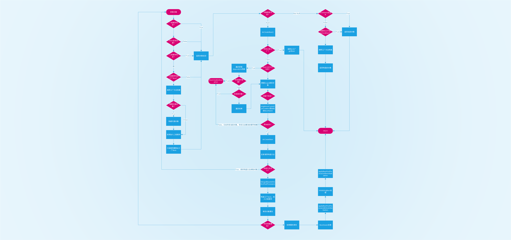

# 2022-05-24
处理针对@Autowired的依赖分析。参考Spring，主要分析三种场景：
1. 通过构造方法注入的，关于构造方法的选择规则如下：
    1. 当该类仅存在一个构造方法时，自动使用该构造方法并获取其依赖列表
    2. 优先获取定义的使用了@Autowired注解的构造方法，同时若类中存在多个@Autowired的构造方法，将抛出异常；
    3. 无@Autowired注解的构造方法时，尝试获取无参数构造方法；
2. 通过Set方法注入的
3. 通过字段注入的

通过获取这些依赖信息，将其扩充至BeanDefinition中，以备初始化时进行处理。

## 关于循环依赖
目前尚未实现循环依赖的检查工作。
Spring的循环依赖默认不被支持，需要使用```spring.main.allow-circular-references = true```这项配置，打开循环依赖的支持。
循环依赖通过二级缓存进行解决，同时为了解决AOP的动态代理生成的新实例，又引入了三级缓存。

但这种场景仅能支持常规的循环依赖问题，对于Spring建议的通过构造方法注入这种场景，依然无法避免循环依赖导致的问题，将抛出异常并终止执行。


# 2022-05-25
## 关于Spring的AbstractBeanFactory中doGetBean方法的代码解析
```java
    @SuppressWarnings("unchecked")
    protected <T> T doGetBean(
			String name, @Nullable Class<T> requiredType, @Nullable Object[] args, boolean typeCheckOnly)
			throws BeansException {

        // 前缀切换
        // Spring对Factory的BeanName进行了处理，当使用BeanFactory的Name获取Bean时，
        // 实际得到的是BeanFactory对象中的getBean方法获取到的Bean对象；若希望获取BeanFactory实例本身，则使用&BeanName的方式获取。
        // 见BeanFactory.FACTORY_BEAN_PREFIX

        String beanName = transformedBeanName(name);
        Object beanInstance;
    
        // Eagerly check singleton cache for manually registered singletons.
        // 实际调用到DefaultSingletonBeanRegistry类的getSingleton方法。
        // 该方法尝试在缓存中获取Bean对应的原始对象（Return the (raw) singleton object registered under the given name.）
        Object sharedInstance = getSingleton(beanName);
        if (sharedInstance != null && args == null) {
            if (logger.isTraceEnabled()) {
                if (isSingletonCurrentlyInCreation(beanName)) {
                    logger.trace("Returning eagerly cached instance of singleton bean '" + beanName +
                            "' that is not fully initialized yet - a consequence of a circular reference");
                }
                else {
                    logger.trace("Returning cached instance of singleton bean '" + beanName + "'");
                }
            }
            // 若该原始对象存在，则尝试获取它的实际对象。
            // 当该实例为Bean时，返回它本身，若为FactoryBean，则调用工厂方法创建出实际的Bean对象
            // (Get the object for the given bean instance,  either the bean instance itself or its created object in case of a FactoryBean.)
            beanInstance = getObjectForBeanInstance(sharedInstance, name, beanName, null);
        }
    
        else {
            
            // 若未从缓存中找到该对象，则尝试创建该对象
            // 首先检查该对象正在（当前线程中）创建，若是，则表示出现了循环引用
            // 检查的原理是Spring将当前线程正在创建的对象写入ThreadLocal中，检查时会判断Set中是否包含当前BeanName
        
            // Fail if we're already creating this bean instance:
            // We're assumably within a circular reference.
            if (isPrototypeCurrentlyInCreation(beanName)) {
                throw new BeanCurrentlyInCreationException(beanName);
            }
    
            // Check if bean definition exists in this factory.
            BeanFactory parentBeanFactory = getParentBeanFactory();
            if (parentBeanFactory != null && !containsBeanDefinition(beanName)) {
                // 尝试从父级工厂中获取当前Bean的BeanDefinition。
                // 若存在父级工厂且未找到当前Bean的BeanDefinition，
                // 则有可能该Bean使用了别名，首先尝试获取Bean的原始名称，之后再尝试获取Bean
        
                // Not found -> check parent.
                String nameToLookup = originalBeanName(name);
                if (parentBeanFactory instanceof AbstractBeanFactory) {
                    return ((AbstractBeanFactory) parentBeanFactory).doGetBean(
                            nameToLookup, requiredType, args, typeCheckOnly);
                }
                else if (args != null) {
                    // Delegation to parent with explicit args.
                    return (T) parentBeanFactory.getBean(nameToLookup, args);
                }
                else if (requiredType != null) {
                    // No args -> delegate to standard getBean method.
                    return parentBeanFactory.getBean(nameToLookup, requiredType);
                }
                else {
                    return (T) parentBeanFactory.getBean(nameToLookup);
                }
            }
            // 若当前方法不只是进行类型检查，而是实际获取对象，则将该Bean标记为已创建（或正要被创建）
            if (!typeCheckOnly) {
                markBeanAsCreated(beanName);
            }
            
            // 通过StartupStep对象，标记操作步骤的启动、通过Tag标记执行阶段以及结束过程
            // 结合Spring的事件机制，可以将过程广播以备其它监听器使用。
            // 但在当前代码中，使用了DefaultApplicationStartup，并未执行任何操作（no op）
            StartupStep beanCreation = this.applicationStartup.start("spring.beans.instantiate")
                    .tag("beanName", name);
            try {
                if (requiredType != null) {
                    beanCreation.tag("beanType", requiredType::toString);
                }
                RootBeanDefinition mbd = getMergedLocalBeanDefinition(beanName);
                checkMergedBeanDefinition(mbd, beanName, args);
    
                // Guarantee initialization of beans that the current bean depends on.
                String[] dependsOn = mbd.getDependsOn();
                // 遍历当前Bean通过@DependsOn注解依赖的其它Bean实例，同时进行循环依赖检查。
                if (dependsOn != null) {
                    for (String dep : dependsOn) {
                        if (isDependent(beanName, dep)) {
                            throw new BeanCreationException(mbd.getResourceDescription(), beanName,
                                    "Circular depends-on relationship between '" + beanName + "' and '" + dep + "'");
                        }
                        // 此处维护两个Map，分别是当前Bean及其待注入的dependentBeanName的Map<beanName, Set<dependentBeanName>>;
                        // 另一个是被依赖的dependentBeanName及其上级对象的Map<dependentBeanName, Set<beanName>>
                        // 之所以这样操作，除了标记当前Bean与注入Bean的关系，同时标记出被注入的Bean同时都被哪些Bean所使用
                        // 由此，当dependentBeanName执行destroy时，会同时将使用它的Bean一起destroy掉
                        registerDependentBean(dep, beanName);
                        try {
                            getBean(dep);
                        }
                        // 尝试获取依赖Bean，若不存在，抛出NoSuchBeanDefinitionException
                        catch (NoSuchBeanDefinitionException ex) {
                            throw new BeanCreationException(mbd.getResourceDescription(), beanName,
                                    "'" + beanName + "' depends on missing bean '" + dep + "'", ex);
                        }
                    }
                }
    
                // 执行Bean的实际创建操作，根据其作用域，执行单例对象创建、原型对象创建或其它作用域对应的创建操作
                // Create bean instance.
                if (mbd.isSingleton()) {
                    /*
                      调用父类DefaultSingletonBeanRegistry.getSingleton(String, ObjectFactory<?>)方法同时生成ObjectFactory的匿名类，用于创建Bean实例。
                      
                      在执行getSingleton时，若不存在对象，会调用ObjectFactory的getObject方法。在此之前，
                      会调用beforeSingletonCreation(beanName)此时会将当前beanName添加到singletonsCurrentlyInCreation这个Set中
                      当一个Bean在三层缓存中都不存在时，会进入该代码，同时添加当前BeanName，之后开始Bean的创建。
                      
                      在非构造器注入的情况下，出现循环依赖时，某个Bean进入该方法，可以获取到对象的工厂Bean，并返回。
                      在循环依赖的两个Bean同时使用构造器注入时，会导致第一个对象A在初始化并生成工厂Bean之前即开始请求第二个对象B，
                      此时三层缓存皆不存在A的Bean或FactoryBean，之后构造B的过程中需要得到A的实例，而A不存在于缓存中，
                      于是再次进入该代码，进而发现A已经存在于singletonsCurrentlyInCreation这个集合中，然后抛出异常。
                      
                      所以从这个角度讲，Spring无法解决同时使用构造器注入的情况下产生的循环依赖
                     */

                    sharedInstance = getSingleton(beanName, () -> {
                        try {
                            // 本方法实际调用子类AbstractAutowireCapableBeanFactory中实现的方法
                            return createBean(beanName, mbd, args);
                        }
                        catch (BeansException ex) {
                            // Explicitly remove instance from singleton cache: It might have been put there
                            // eagerly by the creation process, to allow for circular reference resolution.
                            // Also remove any beans that received a temporary reference to the bean.
                            destroySingleton(beanName);
                            throw ex;
                        }
                    });
                    // 由于拿到的sharedInstance可能是对象本身或是工厂Bean，
                    // 此处进行转换，若为工厂方法，则调用其创建对象的方法生成对象，否则返回Bean本身
                    beanInstance = getObjectForBeanInstance(sharedInstance, name, beanName, mbd);
                }
    
                else if (mbd.isPrototype()) {
                    // It's a prototype -> create a new instance.
                    Object prototypeInstance = null;
                    try {
                        beforePrototypeCreation(beanName);
                        prototypeInstance = createBean(beanName, mbd, args);
                    }
                    finally {
                        afterPrototypeCreation(beanName);
                    }
                    beanInstance = getObjectForBeanInstance(prototypeInstance, name, beanName, mbd);
                }
    
                else {
                    String scopeName = mbd.getScope();
                    if (!StringUtils.hasLength(scopeName)) {
                        throw new IllegalStateException("No scope name defined for bean '" + beanName + "'");
                    }
                    Scope scope = this.scopes.get(scopeName);
                    if (scope == null) {
                        throw new IllegalStateException("No Scope registered for scope name '" + scopeName + "'");
                    }
                    try {
                        Object scopedInstance = scope.get(beanName, () -> {
                            beforePrototypeCreation(beanName);
                            try {
                                return createBean(beanName, mbd, args);
                            }
                            finally {
                                afterPrototypeCreation(beanName);
                            }
                        });
                        beanInstance = getObjectForBeanInstance(scopedInstance, name, beanName, mbd);
                    }
                    catch (IllegalStateException ex) {
                        throw new ScopeNotActiveException(beanName, scopeName, ex);
                    }
                }
            }
            catch (BeansException ex) {
                beanCreation.tag("exception", ex.getClass().toString());
                beanCreation.tag("message", String.valueOf(ex.getMessage()));
                cleanupAfterBeanCreationFailure(beanName);
                throw ex;
            }
            finally {
                beanCreation.end();
            }
        }
    
        return adaptBeanInstance(name, beanInstance, requiredType);
    }

```

## 关于Spring的DefaultSingletonBeanRegistry中getSingleton方法的代码解析
```java
@Nullable
protected Object getSingleton(String beanName, boolean allowEarlyReference) {
        // Quick check for existing instance without full singleton lock
        // 尝试从一级缓存中获取对象实例
        Object singletonObject = this.singletonObjects.get(beanName);
        if (singletonObject == null && isSingletonCurrentlyInCreation(beanName)) {
            // 一级缓存未找到对象实例，且对象处于创建过程中，则尝试去二级缓存获取
            singletonObject = this.earlySingletonObjects.get(beanName);
            if (singletonObject == null && allowEarlyReference) {
                synchronized (this.singletonObjects) {
                    // Consistent creation of early reference within full singleton lock
                    // 二级缓存不存在，则进行加锁，且在得到锁之后重新从一级缓存开始尝试获取对象
                    // 因为得到锁之后，有可能由于之前持有锁的线程已经创建过该对象，所以需要重新尝试逐层获取
                    singletonObject = this.singletonObjects.get(beanName);
                    if (singletonObject == null) {
                        singletonObject = this.earlySingletonObjects.get(beanName);
                        if (singletonObject == null) {
                            ObjectFactory<?> singletonFactory = this.singletonFactories.get(beanName);
                            if (singletonFactory != null) {
                                // 通过Bean工厂创建对象，并将其放入二级缓存
                                singletonObject = singletonFactory.getObject();
                                this.earlySingletonObjects.put(beanName, singletonObject);
                                this.singletonFactories.remove(beanName);
                            }
                        }
                    }
                }
            }
        }
        return singletonObject;
    }
```

# 关于Spring的AbstractAutowireCapableBeanFactory中doCreateBean方法的代码解析
```java
    // 实际创建Bean的操作， 此时Bean的预创建工作已经完成，如postProcessBeforeInstantiation的检查等
    protected Object doCreateBean(String beanName, RootBeanDefinition mbd, @Nullable Object[] args)
            throws BeanCreationException {
    
        // Instantiate the bean.
        BeanWrapper instanceWrapper = null;
        // 若Bean为单例模式，则首先尝试将Bean从factoryBean实例缓存中清除
        if (mbd.isSingleton()) {
            instanceWrapper = this.factoryBeanInstanceCache.remove(beanName);
        }
        // 执行实际的Bean创建工作，根据Bean配置的策略，可能调用工厂方法，构造方法注入或是简单的实例化
        // 当存在构造方法注入时，会查找并生成待注入的对象，此时当前Bean未被添加至任何一层缓存中。
        // 所以当两个Bean使用构造方法注入同时循环依赖时，会因此抛出异常！
        if (instanceWrapper == null) {
            instanceWrapper = createBeanInstance(beanName, mbd, args);
        }
        Object bean = instanceWrapper.getWrappedInstance();
        Class<?> beanType = instanceWrapper.getWrappedClass();
        if (beanType != NullBean.class) {
            mbd.resolvedTargetType = beanType;
        }
    
        // Allow post-processors to modify the merged bean definition.
        // MergedBeanDefinitionPostProcessors的后置处理
        synchronized (mbd.postProcessingLock) {
            if (!mbd.postProcessed) {
                try {
                    applyMergedBeanDefinitionPostProcessors(mbd, beanType, beanName);
                }
                catch (Throwable ex) {
                    throw new BeanCreationException(mbd.getResourceDescription(), beanName,
                            "Post-processing of merged bean definition failed", ex);
                }
                mbd.postProcessed = true;
            }
        }
    
        // Eagerly cache singletons to be able to resolve circular references
        // even when triggered by lifecycle interfaces like BeanFactoryAware.
        // 构造一个工厂Bean，并将其置入三级缓存
        boolean earlySingletonExposure = (mbd.isSingleton() && this.allowCircularReferences &&
                isSingletonCurrentlyInCreation(beanName));
        if (earlySingletonExposure) {
            if (logger.isTraceEnabled()) {
                logger.trace("Eagerly caching bean '" + beanName +
                        "' to allow for resolving potential circular references");
            }
            // 此处将创建的工厂Bean放至三级缓存，当执行工厂Bean的对象创建时
            // getEarlyBeanReference方法会根据当前的bean实例，判断是否需要创建代理对象
            // 若需要，则创建代理对象，将代理对象添加至二级缓存，否则返回Bean本身
            addSingletonFactory(beanName, () -> getEarlyBeanReference(beanName, mbd, bean));
        }
    
        // Initialize the bean instance.
        Object exposedObject = bean;
        try {
            // 填充对象属性
            populateBean(beanName, mbd, instanceWrapper);
            // 执行工厂方法回调及PostProcessor相关操作
            exposedObject = initializeBean(beanName, exposedObject, mbd);
        }
        catch (Throwable ex) {
            if (ex instanceof BeanCreationException && beanName.equals(((BeanCreationException) ex).getBeanName())) {
                throw (BeanCreationException) ex;
            }
            else {
                throw new BeanCreationException(
                        mbd.getResourceDescription(), beanName, "Initialization of bean failed", ex);
            }
        }
    
        if (earlySingletonExposure) {
            Object earlySingletonReference = getSingleton(beanName, false);
            if (earlySingletonReference != null) {
                if (exposedObject == bean) {
                    exposedObject = earlySingletonReference;
                }
                else if (!this.allowRawInjectionDespiteWrapping && hasDependentBean(beanName)) {
                    String[] dependentBeans = getDependentBeans(beanName);
                    Set<String> actualDependentBeans = new LinkedHashSet<>(dependentBeans.length);
                    for (String dependentBean : dependentBeans) {
                        if (!removeSingletonIfCreatedForTypeCheckOnly(dependentBean)) {
                            actualDependentBeans.add(dependentBean);
                        }
                    }
                    if (!actualDependentBeans.isEmpty()) {
                        throw new BeanCurrentlyInCreationException(beanName,
                                "Bean with name '" + beanName + "' has been injected into other beans [" +
                                StringUtils.collectionToCommaDelimitedString(actualDependentBeans) +
                                "] in its raw version as part of a circular reference, but has eventually been " +
                                "wrapped. This means that said other beans do not use the final version of the " +
                                "bean. This is often the result of over-eager type matching - consider using " +
                                "'getBeanNamesForType' with the 'allowEagerInit' flag turned off, for example.");
                    }
                }
            }
        }
    
        // Register bean as disposable.
        try {
            registerDisposableBeanIfNecessary(beanName, bean, mbd);
        }
        catch (BeanDefinitionValidationException ex) {
            throw new BeanCreationException(
                    mbd.getResourceDescription(), beanName, "Invalid destruction signature", ex);
        }
    
        return exposedObject;
    }


```
## Spring获取及创建Bean的过程

